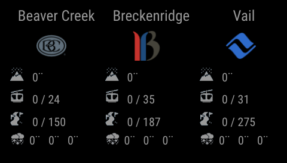

# MMM-Powder
Get snow and powder info for my ski resorts.  Uses OnTheSnow api.


## Config
* the resort ID, 
* a link to the resort logo
* update interval
```
	defaults: {
            resorts: [
                { id: '77', logo: 'https://www.breckenridge.com/Assets/images/sites/breckenridge/favicon.ico' },
                { id: '482', logo: 'https://www.vail.com/Assets/images/sites/vail/favicon.ico' },
                { id: '36', logo: 'https://www.beavercreek.com/Assets/images/sites/beavercreek/favicon.ico'}
            ],
            interval:   18000000 // Every 30 mins (50 api calls per day max)
        },
```
